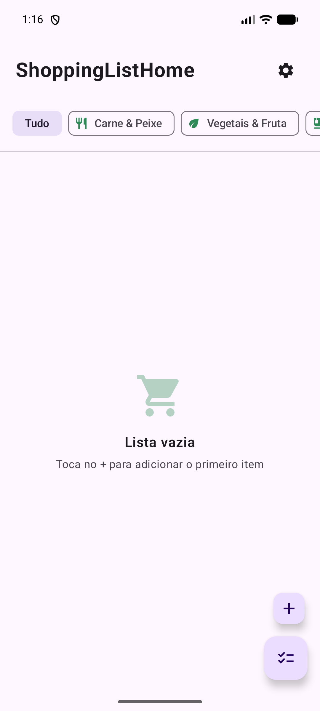

# 🛒 ShoppingListHome — Android

> A free Jetpack Compose shopping list app for Android — no sign-up, no server, no account. Just open it and start adding items.

The Android sibling of [ShoppingListHome for iOS](https://github.com/VidiPT89/ShoppingListHome). Same idea, native Kotlin implementation: keep track of what you need to buy without any of the usual friction. Add items manually or pick them straight from a built-in product catalog grouped by category, track quantity and unit, and check things off as you shop. Everything is stored locally on the device with Room — there's no backend to configure, no login screen, and no internet connection required.



## 📦 What's Inside

- ➕ Add items manually with name, category, quantity, and unit
- 📖 Built-in product catalog, grouped by category, with quick tap-to-add
- 🏷️ Ten shopping categories — meat & fish, vegetables & fruit, dairy, bakery, canned & dry goods, cleaning, hygiene, drinks, snacks, other
- ✅ Check items off as you shop, with a separate "in cart" section
- 🧹 Clear all checked items in one tap
- 🔍 Search the catalog by product name
- 🎨 Light, dark, and system appearance modes
- 🇬🇧🇵🇹 English and Portuguese localization (per-app language, no system setting needed)
- 💾 100% offline, on-device storage via Room — no account, no server, no setup
- 🚀 Animated splash screen on launch

## 🛠️ Tech Stack


-green?style=flat&logo=android&logoColor=white)

## 🏗️ Architecture

```
MVVM + Repository Pattern
│
├── 📦 data
│   ├── ShoppingItem          →  Room @Entity (name, category, quantity, unit, isChecked, createdAt)
│   ├── ItemCategory           →  10 categories, each mapped to a Material icon
│   ├── CatalogData            →  Built-in product catalog, ~250 items grouped by category
│   ├── ShoppingItemDao        →  Room DAO, Flow-based queries
│   ├── AppDatabase            →  Room database singleton
│   ├── ShoppingRepository     →  add/toggle/delete/clearChecked/removeByName
│   └── SettingsRepository     →  DataStore Preferences for theme + language
│
├── 🧠 ui (one package per screen)
│   ├── splash/SplashScreen
│   ├── home/HomeScreen + HomeViewModel   →  Flow<List<ShoppingItem>> as StateFlow
│   ├── catalog/CatalogScreen             →  search, collapsible categories, quantity dialog
│   ├── additem/AddItemScreen             →  manual entry dialog
│   └── settings/SettingsScreen           →  appearance + language
│
└── MainActivity  →  hosts the Compose tree, applies stored theme/locale on launch
```

## 📱 Screens

| Screen | What it does |
|--------|-------------|
| 🚀 **Splash** | Animated launch screen before entering the app |
| 🏠 **Home** | Shopping list split into "To buy" and "In cart", with category filter chips |
| 📖 **Catalog** | Searchable product catalog grouped by category, tap to add with quantity |
| ➕ **Add Item** | Manual dialog to add a custom product with category, quantity, and unit |
| ⚙️ **Settings** | Appearance (system/light/dark) and language (PT/EN) toggles |

## 🔄 How It Works

1. **Launch** — The splash screen animates in while the app initialises
2. **Persistence** — `ShoppingListHomeApp` (the `Application` class) builds the Room `AppDatabase` once and hands a `ShoppingRepository` to the UI layer
3. **List Loading** — `HomeViewModel` exposes `repository.observeItems()` as a `StateFlow`, so the list recomposes automatically on any change
4. **Adding Items** — Items are added either from the catalog (`CatalogScreen`) or a manual dialog (`AddItemScreen`); both call straight into the repository, which inserts into Room
5. **State Changes** — Checking an item, deleting it, or clearing the cart mutates the Room table directly — no network round-trip, ever
6. **Settings** — Theme and language are persisted in DataStore Preferences and applied reactively; language switches use `AppCompatDelegate.setApplicationLocales` for true per-app language on both old and new Android versions

## 📋 Requirements

- 📱 Android 9+ (API level 28)
- 🛠️ Android Studio (Kotlin 2.0, AGP 8.13)

## 🚀 Getting Started

```bash
git clone https://github.com/VidiPT89/ShoppingListHome_android.git
```

1. Open the project in **Android Studio**
2. Let Gradle sync (Kotlin, Compose, Room, and DataStore dependencies resolve from Google/Maven Central)
3. Build and run on an emulator or a physical device running **Android 9+**

There is no backend to configure and no API key to add — the app works immediately.

## 📝 Notes

- All data lives **only on the device** — there's no server, no account, and nothing ever leaves the phone
- Room was chosen over a cloud backend specifically to make the app a true zero-setup, zero-cost experience for anyone who clones it
- The product catalog is a static, hand-picked list — no external API involved
- Because there's no login, there's also no cross-device sync — each install has its own independent list
- 🍎 iOS version — see [ShoppingListHome](https://github.com/VidiPT89/ShoppingListHome), built natively in SwiftUI + SwiftData with the same feature set

---

Developed by **David Arsénio Martins** — *"Vidi"*
